# clodex

## What it is

The front door to a five-skill development workflow for Claude Code + Codex CLI:
`clodex` (this one) routes, and `clodex-plan` → `clodex-build` → `clodex-verify`
→ `clodex-ship` do the work. You invoke one skill; it works out which stage you
are actually in.

This directory is also the workflow's shared infrastructure — the four stage
skills import it rather than reimplementing it:

| Path | What it is |
|---|---|
| `state/clodex_state.py` | Run state: append-only event log, deterministic reducer, session lock, atomic snapshot. Stdlib only. |
| `runner/run-codex.sh` | The one script that invokes Codex, in any role, with a machine-checked result envelope. |
| `profile.schema.json` | The contract for a repository's committed `.clodex/profile.json`. |

The router itself writes no code and calls no model. It runs preflight, notices
an interrupted run and offers to resume it, generates the repo profile on first
use, classifies the shape of the ask, and pins down the change boundary — what
was already dirty before the run touched anything.

## The workflow

```mermaid
flowchart TD
    R["<b>Claude</b><br/>preflight · resume · profile<br/>lane routing · change boundary"]
    R -->|feature| GRD
    R -->|audit| AINV
    R -->|"repair / chore / sync"| NB["lane not built"]

    subgraph PLAN["clodex-plan"]
        GRD["<b>Claude</b><br/>ground in repo<br/>write plan, record hash"]
        GRD --> DG{direction<br/>gate?}
        DG -->|yes| DGP["<b>Claude</b> → user<br/>present premise"]
        DGP -->|CHANGE| GRD
        DGP -->|APPROVED| PRV
        DG -->|no| PRV
        PRV["<b>Codex</b><br/>plan-review round"]
        PRV --> PDI["<b>Claude</b><br/>record & dispose<br/>each finding"]
        PDI --> PCV{converged?}
        PCV -->|"material fix → amend"| PRV
        PCV -->|converged| PAP["<b>Claude</b> → user<br/>approve plan + evidence<br/>bound to content hash"]
        PAP -->|CHANGE| GRD
        PAP -->|APPROVED| BEN
    end

    subgraph BUILD["clodex-build"]
        BEN["<b>Claude</b><br/>change boundary<br/>branch discipline"]
        BEN --> BCT["<b>Claude</b><br/>batch contract<br/>owned · forbidden paths"]
        BCT --> BIM["<b>Codex</b><br/>implement batch"]
        BIM --> BBN{boundary<br/>check}
        BBN -->|STRAY| BAM["<b>Claude</b><br/>amend plan"]
        BAM -.->|"amend → re-approve"| PAP
        BBN -->|clean| BTG{tests green?}
        BTG -->|red| BIM
        BTG -->|green| BDR["<b>Codex</b><br/>delta review"]
        BDR --> BDV{verdict}
        BDV -->|fail| BIM
        BDV -->|pass| BCM["<b>Claude</b><br/>commit by pathspec"]
        BCM --> BNX{more batches?}
        BNX -->|yes| BCT
        BNX -->|no| VEN
    end

    subgraph VERIFY["clodex-verify"]
        VEN["<b>Claude</b><br/>run profile gates"]
        VEN --> VRD{any gate red?}
        VRD -->|finding| VOU{user decides}
        VOU -->|"follow-on run"| VCL["close this run"]
        VOU -->|"user fixes"| VEN
        VOU -->|accepted| VEC
        VRD -->|"all green / null"| VEC
        VEC["<b>Claude</b><br/>per declared class"]
        VEC --> VPR{evidence<br/>produced?}
        VPR -->|yes| VEV["evidence recorded"]
        VPR -->|no| VDB["debt recorded<br/>reason + risk"]
        VEV --> VAL{all classes<br/>covered?}
        VDB --> VAL
        VAL -->|no| VEC
        VAL -->|"yes — debt has no gate"| SEN
    end

    subgraph SHIP["clodex-ship"]
        SEN["<b>Claude</b> + <b>Codex</b><br/>final review: plan hash<br/>unowned commits<br/>release-diff review"]
        SEN --> SAU["<b>Claude</b> → user<br/>release authorization<br/>literal argv + accepted debt"]
        SAU -->|CHANGE| SAU
        SAU -->|ABANDON| SAB(["abandoned"])
        SAU -->|AUTHORIZED| SST["two-phase steps<br/>bookkeeping · commit<br/>tag · push · deploy"]
        SST --> SPU{push result}
        SPU -->|push-failed| SRC["<b>Claude</b><br/>reconcile vs remote"]
        SRC -->|retry| SST
        SPU -->|ok| SDE{deploy result}
        SDE -->|deploy-failed| SDR["<b>Claude</b><br/>reconcile vs host"]
        SDR -->|retry| SST
        SDE -->|not-deployed| SND(["not-deployed"])
        SDE -->|landed| SVL{verify-live?}
        SVL -->|pass| SVR(["verified-live"])
        SVL -->|fail| SDR
    end

    subgraph AUDIT["clodex-audit"]
        AINV["<b>Claude</b><br/>read-only investigation<br/>tag every claim"]
        AINV --> ARPT["report:<br/>VERIFIED / HYPOTHESIS<br/>per-item routing"]
    end
    ARPT -.->|"routes follow-on runs"| R

    SVR --> CLS["run closed"]
    SND --> CLS
    SAB --> CLS
    VCL -.->|follow-on| R
```



Claude orchestrates every stage; Codex sits on the other side of the table —
it reviews the plan, implements the batches, and reviews the diffs, so the
writer and the reviewer are never the same model. The control-flow style —
decision diamonds, loop-backs, actors on every node — comes from the
[TRIP workflow](https://github.com/PiLastDigit/TRIP-workflow)'s README diagram,
which remains the standard this one is measured against; TRIP is this
workflow's ancestor, and its Plan → Implement → Review → Test loop is what
the stages above grew out of.

The current contract is explicit at the seams. Verification uses exactly five
evidence classes: `tests`, `real-data`, `live-check`, `visual`, and
`client-artifact`. The shared runner records each declared input's hash at
invocation start and an end observation when available in the result envelope;
exact-input checks fail closed on a missing, malformed, partial, or legacy
hash-less result, and the stage skills advance only on a valid `complete`
envelope (their prose contract, not a reducer invariant). Each derivation or
currency probe builds the inspected record and its fingerprint from one
marker pass (derive and the later preflight check are separate probes); the
VERSION-discipline test requires
`skills/clodex/VERSION` to change with a changed clodex `SKILL.md`. Approval
events carry an explicit attribution: run-scoped mandates can be granted when
a run opens, bind to that run, and are revoked by a plan amendment.

## What it's good for

- **Not memorizing stage names.** The workflow this replaces had ten stages;
  five of them were never once invoked across 53 threads. Capability behind a
  name you have to remember is capability that rots. One front door reads the
  repo and the ask and proposes the lane.
- **Preflight that actually runs.** Repo root, remote reachability, the
  `.clodex/` ignore rule, runtimes, Codex auth, credential names — checked in
  seconds, before a stage spends real money discovering the same thing.
- **Resuming instead of restarting.** Runs are durable event logs, not chat
  history. A session that dies mid-build leaves a run you can pick up: current
  stage, plan version, open findings, verification debt, and any release step
  left pending. A stale lock is surfaced and resolved with you, never broken
  behind your back.
- **A change boundary you can trust.** The run records the start commit and the
  files that were already dirty. If pre-existing work overlaps paths the plan
  wants to own, there are exactly three ways out — fold it in with the diff
  captured first, isolate the run in a clean worktree, or abort — and none of
  them is "commit it and hope." Your unrelated work in progress never lands in
  someone else's commit.
- **Per-repo behavior without per-repo forks.** The engine installs once,
  globally. A repository contributes only `.clodex/profile.json`: its commands,
  version source, branch and tag rules, deploy target, live checks, evidence
  expectations, and the exact external actions clodex may propose — each marked
  either "runs under the release authorization" or "show me the literal command
  every single time."

Honest scope: v0.1 ships the feature lane only. Audit, repair, chore, and sync
asks are *noticed* — named, told plainly that the lane is not built, and handed
back with the closest manual approach — but they are not automated. That is
deliberate; those lanes enter v0.2 with usage evidence behind them.

## Who it's for

Someone running Claude Code and Codex CLI on their own repositories who wants
work to survive a dead session and a release to be a state machine rather than a
hopeful message. It assumes git, a POSIX machine, Python 3.9+, and a logged-in
`codex`.

It descends from the TRIP workflow by PiLastDigit (MIT) — the stage vocabulary
and the Codex review roles originate there — redesigned around a private study
of how that workflow actually got used.

## Install

```bash
ln -s "$(pwd)/skills/clodex" ~/.claude/skills/clodex
```

The four stage skills install the same way; the router expects to find them
beside it.
